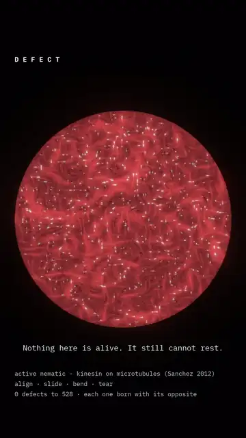
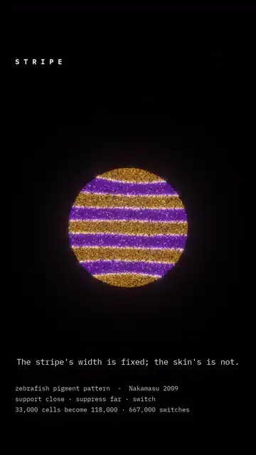
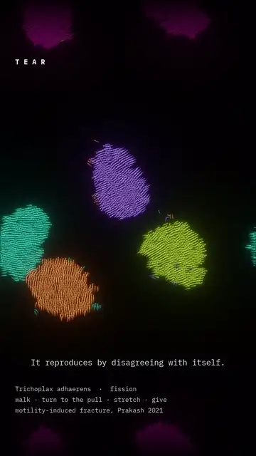
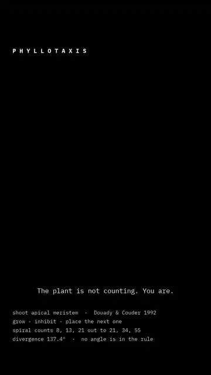
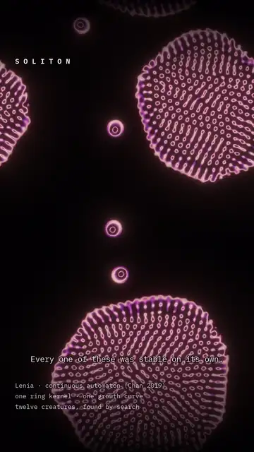

<pre>
█▀▀▀ █ ▄▀ █▀▀▀ █▀▀█ █▀▀▀ █▀▀█ ▀██▀ █▀▀█ █▀▀▄ █▄ █ ▀██▀ █▀▀▀ ▀▀██ █▀▀▀ █▀▀▀ █▀▀█
█▀▀  ██   ▀▀▀█ █▀▀▀ █▀▀  ██▀▀  ██  █  █ █  █ █▀▄█  ██  █    ▄█▀  █▀▀  █ ▀█ █  █
█▄▄▄ █ ▀▄ ▄▄▄█ █    █▄▄▄ █ ▀▄  ██  █▄▄█ █▄▄▀ █ ▀█ ▄██▄ █▄▄▄ █▄▄▄ █▄▄▄ █▄▄█ █▄▄█
───────────────────────────────────────────────────────────────────────────────
     B I O L O G Y    I S    T H E    O R I G I N A L    A L G O R I T H M
</pre>

Six processes, each one computing something — a form, a network, a decision
about where to grow. The model runs, the run *is* the footage, and the colour is
a quantity the model carries: how old an organ is, which of two cells won that
patch of skin, how stretched a bond is at that instant.

---

<table>
<tr>
<td width="33%"></td>
<td width="33%"></td>
<td width="33%"></td>
</tr>
<tr valign="top">
<td><b><a href="reels/defect/">Defect</a></b> Substrate · an organism's parts, organism removed  <i>Nothing here is alive. It still cannot rest.</i></td>
<td><b><a href="reels/stripe/">Stripe</a></b> Wetware · a pattern the tissue argues out  <i>Turing predicted chemicals. These are cells.</i></td>
<td><b><a href="reels/tear/">Tear</a></b> Wetware · an animal that pulls itself apart  <i>It reproduces by disagreeing with itself.</i></td>
</tr>
<tr>
<td></td>
<td></td>
<td></td>
</tr>
<tr valign="top">
<td><b><a href="reels/phyllotaxis/">Phyllotaxis</a></b> Wetware · a shoot apex placing organs  <i>The plant is not counting. You are.</i></td>
<td><b><a href="reels/hydrocreatures/">Hydrocreatures</a></b> Biomorph · three animals that are not animals  <i>Nothing here intends anything. You do.</i></td>
<td><b><a href="reels/soliton/">Soliton</a></b> Artificial Life · Lenia, and what one collision does  <i>Every one of these was stable on its own.</i></td>
</tr>
</table>

**The full cuts are on [Instagram](https://instagram.com/ekspertodniczego).**

---

## The six models

Each entry is the update rule as implemented, followed by the parameters the
clip was actually run at. None of these rules contains the thing it produces:
there is no angle in the phyllotaxis rule, no fold in the growth rule, no
membrane, no stripe count and no spiral.

### Defect — an active nematic with no cell around it

Microtubules, kinesin, ATP. Beris–Edwards for the alignment tensor with one
elastic constant, coupled to Stokes flow, with an active stress proportional to
the alignment itself:

$$\partial_t Q + \mathbf{u}\cdot\nabla Q  =  S(\nabla\mathbf{u}, Q) + \Gamma H
\qquad\qquad \sigma^{\text{act}} = -\zeta\ Q$$

That last term is the whole piece: **alignment is turned into flow, and the flow
bends the alignment that produced it.** There is no activity level at which an
aligned film is stable against itself, so it buckles; a bend that keeps growing
cannot stay a bend; and where the director breaks it turns by half a turn around
a point. Halves cannot exist alone, so $\pm\tfrac{1}{2}$ defects are created in
pairs and annihilate in pairs. The $+\tfrac{1}{2}$ has a comet head and swims,
the $-\tfrac{1}{2}$ has three arms and mostly sits.

| | |
| --- | --- |
| defects | 0 → 528 over the clip |
| charge balance | 232 of one sign against 234 of the other, counted well inside the drop |
| steady state | none — a fixed rate of tearing for as long as there is ATP |

Sanchez et al. (2012).

### Stripe — cell-level Turing, short-range support and long-range suppression

Nakamasu et al. (2009), whose interaction was measured by laser-ablating cells
one at a time. Two Gaussians on the signed cell field:

$$D  =  G_{\sigma_{\text{near}}} * f  -  w\ \bigl(G_{\sigma_{\text{far}}} * f\bigr)$$

where $f = +1$ on a melanophore and $f = -1$ on a xanthophore.

A cell adopts $\mathrm{sign}(D)$ with probability $\lambda$ per step. This
is Turing's shape with **whole cells standing where the chemicals were** — the
morphogens are the pigment cells themselves, each reading its neighbourhood and
changing type when the answer is wrong.

The two ranges are the reach of one cell's processes, so they are fixed while
the skin keeps widening. A stripe therefore has a width it wants; existing
stripes are carried apart; and when the gap exceeds that width a new stripe
nucleates inside it. Nothing counts them — the number is the skin's height over
a width that no cell chose.

| | |
| --- | --- |
| cells | 33,000 → 118,000, with 667,000 type switches |
| growth | radius advances a **fixed amount** per step, not a fixed fraction — stripe count goes as radius, so only linear growth spreads the splitting evenly across the clip |
| convolution | `mode="nearest"`, never wrapped — a rim cell must not read the far side of the disc, or stripes stitch across the black |
| $\lambda$ | well under 1: switching every disagreeing cell at once gives a hard line that snaps between frames instead of a border being argued over |

### Tear — motility-induced fracture in a placozoan

*Trichoplax adhaerens* has no nerves and no muscle; it crawls on cilia, and
every ventral cell walks on its own. The alignment comes from Ferrante et al.
(2013): a cell is pulled by its neighbours and **turns toward the pull**.

$$\dot{\mathbf{x}}_i = v_0\ \hat{n}_i + \mu\ \mathbf{F}_i
\qquad\qquad
\dot{\theta}_i = \beta\ \bigl(\mathbf{F}_i \cdot \hat{n}_i^{\perp}\bigr) + \eta_i$$

That rule alone lines thousands of cells up into one heading. But nothing
coordinates them globally, so a large enough animal holds patches that agree
internally and disagree with each other, and the tissue between them stretches.
Bonds past a strain threshold yield; bonds re-form between nearby cells of the
same animal, so the sheet tears rather than shatters. Prakash, Bull & Prakash
(2022) filmed exactly this.

**Growth is the clock.** Cells divide in place, so the halves grow back to the
size at which they tear again. Without division the process is a relaxation —
measured at the gate, sixteen animals shattered into thirty-seven pieces in the
first quarter and nothing tore after: 85.2% of the change, then 0.0%.

| | |
| --- | --- |
| $v_0$, $\beta$ | 0.3, 1.0 |
| rotational noise | 0.02 |
| bond spring | 1.0, with a strain threshold above which it yields |
| units | one cell spacing = 1; dish radius = 93 spacings |
| colour | animal identity — a tear is one colour becoming two; strain rides in the brightness |

### Phyllotaxis — inhibition-field organ placement

Douady & Couder (1992). One organ per plastochrone, placed at the rim angle
that minimises the inhibition of those already down:

$$\theta_{n+1}=\arg\min_{\theta}\ \sum_{j\ \in\ \mathcal{N}} \lVert x(\theta)-p_j \rVert^{-2}
\qquad\qquad r_j \propto \sqrt{\mathrm{age}_j}$$

The radial law is not a choice of look. Organs are added at a constant rate, so
constant areal density requires area to grow at a constant rate, which gives
$r\propto\sqrt{t}$ and makes the head **self-similar**. A self-similar head
admits exactly one divergence angle for every organ it will ever place, so
137.5° is fixed on the first few organs and cannot drift afterwards. The
Fibonacci parastichy counts (8, 13, 21 near the core; 21, 34, 55 at the rim)
follow from the rim flattening as the head widens.

| | |
| --- | --- |
| organs | 1,196 |
| inhibition sum | 60 nearest-youngest only — the $d^{-2}$ term puts everything older out of range |
| candidate angles | re-offset each step by a uniform fraction of their own spacing, or the result locks to the sampling grid rather than to the rule |
| colour | age, `APEX` ramp — youngest at the centre, so the bright end is the core |

### Hydrocreatures — three animals from one closed curve

Nothing is simulated here and nothing emerges. One parametric curve, sampled
densely and drawn as dots, at three settings of the same expression:

$$k = 9\cos(ai)\sin(bi), \qquad e = 9\cos(ci)\sin(fi)$$

$$d = \frac{\lVert (k,e) \rVert^{3}}{999} + 1.2 - \frac{\sin^{3}\left(\tfrac{t}{2}+m\right)}{4},
\qquad p = d^{\ \sin\left(d^{2}-t+m\right)}$$

$$C = \frac{d}{9} - \frac{t}{24} + m, \qquad x = 99\sin C + k\ p, \qquad y = 99\sin 4C + e\ p$$

$d$ is the breath, $p$ the stretch, $C$ the lean that carries the figure along
its path. The three creatures differ in four small integers $(a,b,c,f)$ and one
phase $m$ — change one integer and a bell becomes a pod, a pod grows filaments,
the filaments close into a lily.

They were not designed, they were **found**: every harmonic set up to six was
scored on the *worst* moment of its cycle rather than the average, because a
shape that is a bell half the time and a cross the other half scores well on an
average and reads badly on screen. Eleven survived out of 1,260.

| | |
| --- | --- |
| samples | ~11,000 along one closed curve |
| search | 1,260 harmonic sets, 11 survivors, 3 shown |
| what is fitted | nothing — the animal is the closed form |

### Soliton — Lenia

Conway's Life with four things made continuous: a real number instead of a bit,
a smooth ring kernel $K$ instead of eight neighbours, one smooth growth curve
$G$ instead of birth and survival integers, and a timestep that moves the field
by a fraction of the growth rather than all of it.

$$A^{t+\Delta t}  =  \Bigl[\  A^{t} + \Delta t \cdot G\bigl(K * A^{t}\bigr) \ \Bigr]_{0}^{1}$$

What comes out are not blinkers and gliders but **solitons** — lumps of
continuous field, smooth-edged and internally structured, that hold themselves
together while they travel. Nothing about them is designed. A creature is a
point in parameter space, and almost all of that space is lethal in one of two
ways: the field collapses to nothing, or it grows without bound until it fills
the world. The survivors sit in the narrow band between and have to be searched
for.

| | |
| --- | --- |
| $\Delta t$ | 1/10 — a step moves the field by a tenth of the growth |
| creature | ring with a core, ~60 cells across, travelling at ⅓ cell per step |
| field | 12 copies of one creature, doubly periodic, simulated at half resolution and doubled on output |

Chan (2019).

---

## Four editions

The work is sorted by what kind of claim a piece is allowed to make. Keeping
those claims apart is the discipline of the whole account: it is the difference
between showing you biology and showing you a curve that flatters you into
seeing biology.

| Edition | The process is | The claim it makes |
| --- | --- | --- |
| **Wetware** | morphogenesis — how a body builds itself | this is biology, filmed as the algorithm it is |
| **Substrate** | something a microscope can be pointed at, on a medium | the medium is the computer |
| **Biomorph** | a parametric equation, not a simulation | it only *looks* alive — and that is the point |
| **Artificial Life** | a rule invented inside a computer | being alive may be organisation, so it can be built out of numbers |

**Biomorph is the honest odd one out**, and *Hydrocreatures* is why it is worth
keeping. Nothing emerges and no piece there claims anything is alive; the
edition earns its place because apparent life out of a closed form is a real
fact about how cheaply intention can be faked. A body that changes shape
smoothly, travels in the direction it is pointing, and slows before it turns is
enough to trip the circuit.

**Artificial Life is the only edition with an opinion.** Everything else is a
fact about the world with a picture attached; that one is a picture with an
argument attached, and the argument is Langton's.

---

## Credits

The models are other people's; the films are mine. Where a piece rests on a
published model, the citation is burned into the frame rather than left to the
caption:

- **Douady & Couder, 1992** — the shoot apex as a physical system — *Phyllotaxis*
- **Nakamasu et al., 2009** — the zebrafish interaction, measured by laser ablation — *Stripe*
- **Ferrante et al., 2013** and **Prakash, Bull & Prakash, 2022** — alignment by pulling, and motility-induced fracture — *Tear*
- **Sanchez et al., 2012** — kinesin walking on microtubules — *Defect*
- **Bert Wang-Chak Chan, 2019** — Lenia — *Soliton*

*Hydrocreatures* rests on no paper. It is a closed-form curve and a search over
harmonics, and it is mine.

---

## Why "On Growth and Form"

Partly borrowed from **D'Arcy Wentworth Thompson**, *On Growth and Form* (1917)
— the book that argued the shapes living things take are set by physics and
mathematics, and not by descent alone. Thompson had no computers and made the
argument with geometry. The point of running these as simulations is that his
claim is now cheap to test: write the rule, let it run, and see whether the
animal falls out.

---

Paulina Duda — bioinformatician. The reels go out as
[@ekspertodniczego](https://instagram.com/ekspertodniczego).

**Licence.** Renders and copy: [CC BY-NC-SA 4.0](LICENSE). Attribute
@ekspertodniczego.
