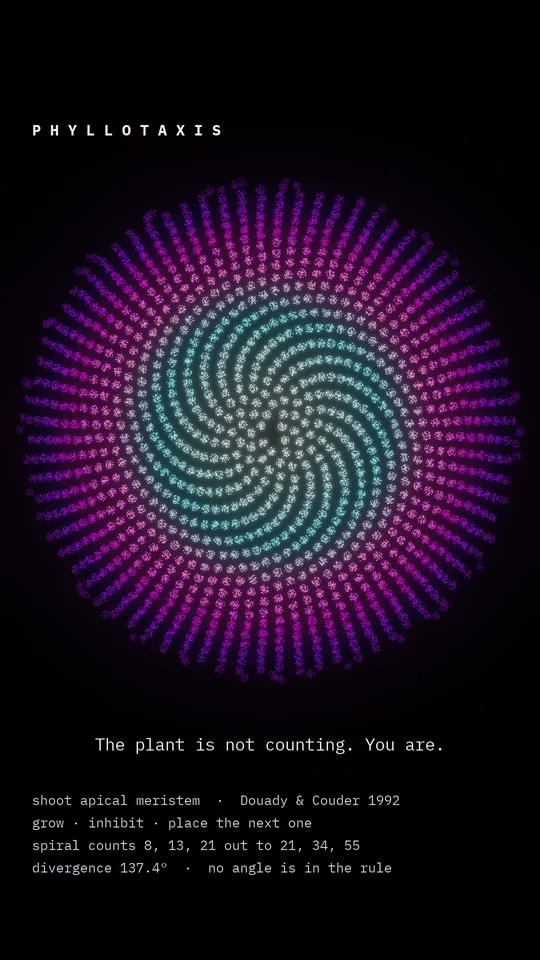
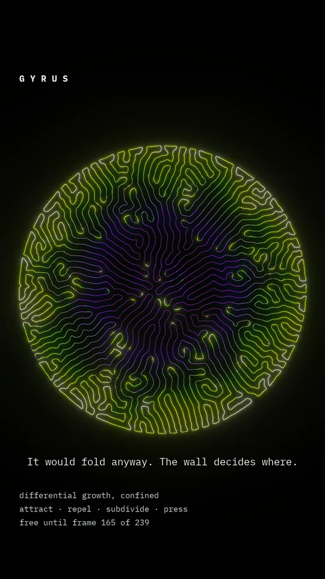
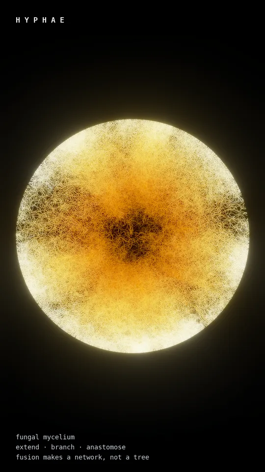
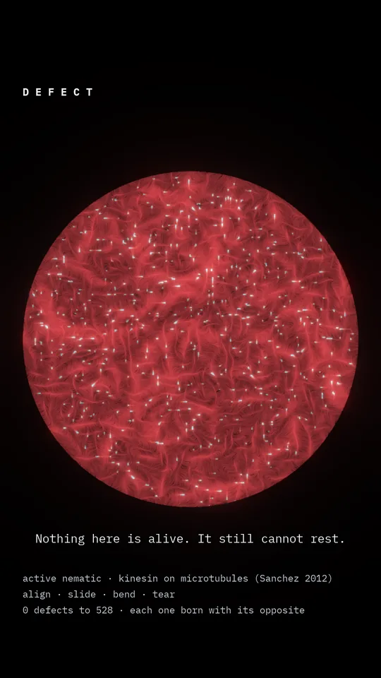
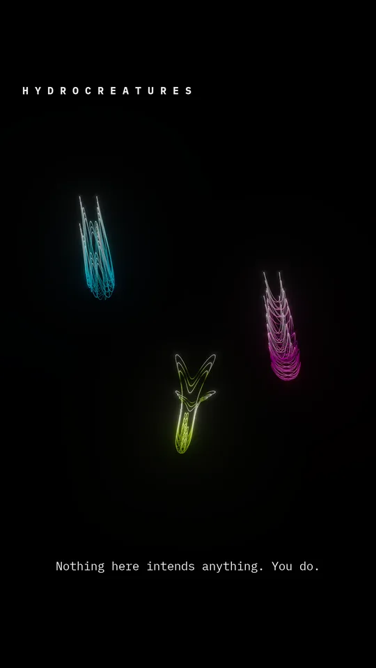
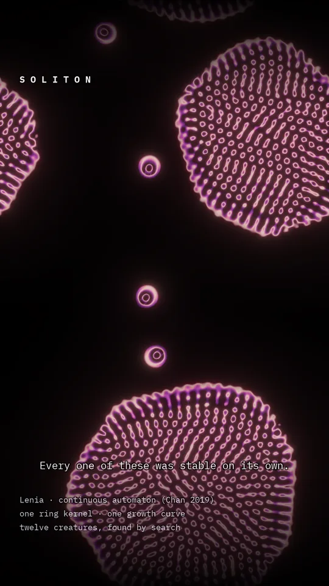

```
█▀▀▀▀  █  ▄▀  █▀▀▀▀  █▀▀▀█  █▀▀▀▀  █▀▀▀█  ▀▀█▀▀
█▀▀▀   █▀█    ▀▀▀▀█  █▀▀▀▀  █▀▀▀   █▀█▀▀    █
█▄▄▄▄  █  ▀▄  ▄▄▄▄█  █      █▄▄▄▄  █  ▀▄    █

█▀▀▀█  █▀▀▀▄  █▄  █  ▀▀█▀▀  █▀▀▀▀  ▀▀▀█▀  █▀▀▀▀  █▀▀▀▀  █▀▀▀█
█   █  █   █  █ █ █    █    █       ▄▀    █▀▀▀   █ ▀▀█  █   █
█▄▄▄█  █▄▄▄▀  █  ▀█  ▄▄█▄▄  █▄▄▄▄  █▄▄▄▄  █▄▄▄▄  █▄▄▄█  █▄▄▄█
```

# Biology is the original algorithm

[](https://instagram.com/ekspertodniczego)
[](https://www.python.org/)
[](LICENSE)

Every piece here is a process that computes something — a form, a network, a
decision about where to grow — running on wet matter rather than silicon, and
filmed while it computes.

Nothing is an illustration of a result. The model runs, the run *is* the
footage, and the colour is a quantity the model actually carries: how old a cell
is, which species it belongs to, how hard it is pulling at that instant. Frame
one is the finished object, because frame one is the thumbnail.

---

## Six of them

<table>
<tr>
<td width="33%"><a href="reels/phyllotaxis/"></a></td>
<td width="33%"><a href="reels/gyrus/"></a></td>
<td width="33%"><a href="reels/hyphae/"></a></td>
</tr>
<tr valign="top">
<td><b><a href="reels/phyllotaxis/">Phyllotaxis</a></b><br><sub>Wetware · a shoot apex placing organs</sub><br><br><i>The plant is not counting.<br>You are.</i></td>
<td><b><a href="reels/gyrus/">Gyrus</a></b><br><sub>Wetware · differential growth against a wall</sub><br><br><i>It would fold anyway.<br>The wall decides where.</i></td>
<td><b><a href="reels/hyphae/">Hyphae</a></b><br><sub>Substrate · a mycelium closing its own loops</sub><br><br><i>A tree branches.<br>A fungus branches back.</i></td>
</tr>
<tr>
<td><a href="reels/defect/"></a></td>
<td><a href="reels/hydrocreatures/"></a></td>
<td><a href="reels/soliton/"></a></td>
</tr>
<tr valign="top">
<td><b><a href="reels/defect/">Defect</a></b><br><sub>Substrate · an organism's parts, organism removed</sub><br><br><i>Nothing here is alive.<br>It still cannot rest.</i></td>
<td><b><a href="reels/hydrocreatures/">Hydrocreatures</a></b><br><sub>Biomorph · three animals that are not animals</sub><br><br><i>Nothing here intends anything.<br>You do.</i></td>
<td><b><a href="reels/soliton/">Soliton</a></b><br><sub>Artificial Life · Lenia, and what one collision does</sub><br><br><i>Every one of these<br>was stable on its own.</i></td>
</tr>
</table>

Each image is frame one of its reel — the frame the piece is composed for.
**The moving cuts are on [Instagram](https://instagram.com/ekspertodniczego).**

---

## Four editions

The work is sorted by what kind of claim a piece is allowed to make. Keeping
those claims apart is the whole discipline of the account: it is the difference
between showing you biology and showing you a curve that flatters you into
seeing biology.

| Edition | The process is | The claim it makes |
| --- | --- | --- |
| **Wetware** | morphogenesis — how a body builds itself | this is biology, filmed as the algorithm it is |
| **Substrate** | something a microscope can be pointed at, on a medium | the medium is the computer |
| **Biomorph** | a parametric equation, not a simulation | it only *looks* alive — and that is the point |
| **Artificial Life** | a rule invented inside a computer | being alive may be organisation, so it can be built out of numbers |

**Biomorph is the honest odd one out.** Nothing emerges; it is a closed-form
curve, and no piece there claims anything is alive. It earns its place because
*apparent* life out of an equation is a real and slightly uncomfortable fact
about how readily we read intention into motion — which is stated in the copy
rather than hidden.

**Artificial Life is the only edition with an opinion.** Everything else is a
fact about the world with a picture attached; that one is a picture with an
argument attached, and the argument is Langton's.

---

## Format

1080 × 1920, 30 fps, H.264, no audio, 8 to 12 seconds — decided per reel, not
per edition, because two of these needed the extra time and the rest did not.

Composed on black. Brightness is how much stuff is there: additive splatting,
log-density tone mapping and multi-scale bloom, so a dense region is bright
because it is dense, not because it was coloured brighter. Colour is always a
measured quantity intrinsic to the subject and never decoration. Type is IBM
Plex Mono throughout, with DejaVu Sans Mono reserved for data blocks that carry
Greek — and the Greek stays Greek: σ, ρ, β, not `s`, `r`, `b`.

Every clip is reproducible from its model. Rendered video is not committed here;
what went out is on the account.

---

## Credits

The models are other people's; the films are mine. Where a piece rests on a
published model, the citation is burned into the frame rather than left to the
caption:

- **Lenia** — Bert Wang-Chak Chan, 2019 — *Soliton*
- **Douady & Couder, 1992**, the shoot apex as a physical system — *Phyllotaxis*
- **Sanchez et al., 2012**, kinesin walking on microtubules — *Defect*
- The closed curve behind *Hydrocreatures* is of the **yuruyurau** family

*Gyrus* and *Hyphae* rest on no single paper: differential growth under
confinement, and tip extension with anastomosis, are both standard enough to
implement from the biology directly.

---

## Why "On Growth and Form"

Partly borrowed from **D'Arcy Wentworth Thompson**, *On Growth and Form* (1917)
— the book that argued the shapes living things take are set by physics and
mathematics, and not by descent alone. Thompson had no computers and made the
argument with geometry and a great deal of nerve. The point of running these as
simulations is that his claim is now cheap to test: write the rule, let it run,
and see whether the animal falls out.

---

Paulina Duda — bioinformatician. The reels go out as
[@ekspertodniczego](https://instagram.com/ekspertodniczego).

**Licence.** Renders and copy: [CC BY-NC-SA 4.0](LICENSE). Attribute
@ekspertodniczego.
