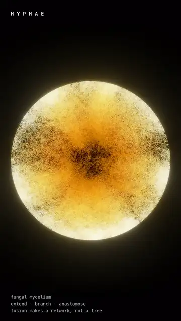

```
█▀▀▀▀ █  ▄▀ █▀▀▀▀ █▀▀▀█ █▀▀▀▀ █▀▀▀█ ▀▀█▀▀ █▀▀▀█ █▀▀▀▄ █▄  █ ▀▀█▀▀ █▀▀▀▀ ▀▀▀█▀ █▀▀▀▀ █▀▀▀▀ █▀▀▀█
█▀▀▀  █▀█   ▀▀▀▀█ █▀▀▀▀ █▀▀▀  █▀█▀▀   █   █   █ █   █ █ █ █   █   █      ▄▀   █▀▀▀  █ ▀▀█ █   █
█▄▄▄▄ █  ▀▄ ▄▄▄▄█ █     █▄▄▄▄ █  ▀▄   █   █▄▄▄█ █▄▄▄▀ █  ▀█ ▄▄█▄▄ █▄▄▄▄ █▄▄▄▄ █▄▄▄▄ █▄▄▄█ █▄▄▄█
───────────────────────────────────────────────────────────────────────────────────────────────
             B I O L O G Y    I S    T H E    O R I G I N A L    A L G O R I T H M
```

[](https://instagram.com/ekspertodniczego)
[](https://www.python.org/)
[](LICENSE)

Every piece here is a process that computes something — a form, a network, a
decision about where to grow — running on wet matter rather than silicon, and
filmed while it computes.

Nothing is an illustration of a result. The model runs, the run *is* the
footage, and the colour is a quantity the model actually carries: how old a cell
is, which of two cells won that patch of skin, how hard a sheet is pulling at
that instant.

---

<table>
<tr>
<td width="33%"><a href="reels/phyllotaxis/"></a></td>
<td width="33%"><a href="reels/stripe/"></a></td>
<td width="33%"><a href="reels/gyrus/"></a></td>
</tr>
<tr valign="top">
<td><b><a href="reels/phyllotaxis/">Phyllotaxis</a></b><br><sub>Wetware · a shoot apex placing organs</sub><br><br><i>The plant is not counting.<br>You are.</i></td>
<td><b><a href="reels/stripe/">Stripe</a></b><br><sub>Wetware · a pattern the tissue argues out</sub><br><br><i>Turing predicted chemicals.<br>These are cells.</i></td>
<td><b><a href="reels/gyrus/">Gyrus</a></b><br><sub>Wetware · differential growth against a wall</sub><br><br><i>It would fold anyway.<br>The wall decides where.</i></td>
</tr>
<tr>
<td><a href="reels/hyphae/"></a></td>
<td><a href="reels/defect/"></a></td>
<td><a href="reels/soliton/"></a></td>
</tr>
<tr valign="top">
<td><b><a href="reels/hyphae/">Hyphae</a></b><br><sub>Substrate · a mycelium closing its own loops</sub><br><br><i>A tree branches.<br>A fungus branches back.</i></td>
<td><b><a href="reels/defect/">Defect</a></b><br><sub>Substrate · an organism's parts, organism removed</sub><br><br><i>Nothing here is alive.<br>It still cannot rest.</i></td>
<td><b><a href="reels/soliton/">Soliton</a></b><br><sub>Artificial Life · Lenia, and what one collision does</sub><br><br><i>Every one of these<br>was stable on its own.</i></td>
</tr>
</table>

**The full cuts are on [Instagram](https://instagram.com/ekspertodniczego).**

---

## What is actually running

Six rules. None of them contains the thing it produces — no angle in the
phyllotaxis rule, no fold in the growth rule, no spiral, no stripe count, no
membrane. That gap between what is written and what appears is the entire
subject of the account.

**Phyllotaxis** · *a shoot apex placing organs*

```
θₙ₊₁ = argmin  Σⱼ |x(θ) − pⱼ|⁻²            rⱼ ∝ √ageⱼ
         θ
```

Put the next organ at the rim angle the existing organs object to least, then
let the tissue underneath carry everything outwards. Constant density forces
radius to go as the square root of age, which makes the head self-similar — and
a self-similar head has exactly **one** divergence angle for every organ it will
ever place. 137.5° and the Fibonacci spiral counts are consequences, not inputs.
Douady & Couder, 1992.

**Stripe** · *a zebrafish pattern computed by the tissue*

```
drive = G(σ_near) * f  −  w · G(σ_far) * f        f = +1 black, −1 yellow
a cell becomes sign(drive), with probability λ per step
```

Turing's shape — support your own kind close in, suppress it further out — with
**whole cells standing where the chemicals were**. The two ranges are the reach
of one cell's processes, so they are fixed while the skin keeps widening: a
stripe has a width it wants, existing stripes are carried apart, and a new one
nucleates in the gap. Nothing counts them. Nakamasu, 2009.

**Gyrus** · *differential growth under confinement*

```
pᵢ ← pᵢ + α·( (pᵢ₊₁ + pᵢ₋₁)/2 − pᵢ ) + ρ·Σⱼ (pᵢ − pⱼ) / |pᵢ − pⱼ|²
split any edge longer than ℓ   ·   push back anything past the wall
```

A closed curve that gains length faster than its dish gains room. The folding is
not caused by the wall — the same curve folds in open space — the wall decides
**where each fold goes**, which is the harder half of the result to see.

**Hyphae** · *tip extension with anastomosis*

```
extend at the tip only  ·  branch  ·  on contact, fuse and stop
```

The third clause is the whole difference between a fungus and a tree. A tree's
branches diverge and never meet, so a tree has no loops and one path between any
two points. A mycelium fuses, so it has loops: it can route around damage and
move material by more than one road. The network is not a by-product of growing;
it is what the growing is for.

**Defect** · *an active nematic*

```
∂ₜQ + u·∇Q = S(∇u, Q) + ΓH              σ_active = −ζQ
```

Beris–Edwards for the alignment, coupled to Stokes flow, with an active stress
proportional to the alignment itself. That coupling is the trick: **alignment is
turned into flow, and the flow bends the alignment that produced it.** No
activity level makes an aligned film stable against itself, so it tears, and
where it tears the director turns by half a turn — a ±½ defect. Halves cannot
exist alone, so they arrive in pairs, and they annihilate in pairs. Sanchez,
2012.

**Soliton** · *Lenia*

```
Aᵗ⁺ᵈᵗ = clip( Aᵗ + dt · G(K ∗ Aᵗ) , 0, 1 )
```

Conway's Life with four things made continuous: a real number instead of a bit,
a smooth ring kernel *K* instead of eight neighbours, one smooth growth curve *G*
instead of birth and survival integers, and a timestep that moves the field by a
fraction of the growth instead of all of it. Out come lumps of field that hold
themselves together while they travel. Nothing about them is designed — almost
all of the parameter space is lethal, and the survivors have to be searched for.
Chan, 2019.

---

## Four editions

The work is sorted by what kind of claim a piece is allowed to make. Keeping
those claims apart is the discipline of the whole account: it is the difference
between showing you biology and showing you a curve that flatters you into
seeing biology.

| Edition | The process is | The claim it makes |
| --- | --- | --- |
| **Wetware** | morphogenesis — how a body builds itself | this is biology, filmed as the algorithm it is |
| **Substrate** | something a microscope can be pointed at, on a medium | the medium is the computer |
| **Biomorph** | a parametric equation, not a simulation | it only *looks* alive — and that is the point |
| **Artificial Life** | a rule invented inside a computer | being alive may be organisation, so it can be built out of numbers |

**Biomorph is the honest odd one out.** Nothing emerges; it is a closed-form
curve, and no piece there claims anything is alive. It earns its place because
*apparent* life out of an equation is a real and slightly uncomfortable fact
about how readily we read intention into motion — which is stated in the copy
rather than hidden.

**Artificial Life is the only edition with an opinion.** Everything else is a
fact about the world with a picture attached; that one is a picture with an
argument attached, and the argument is Langton's.

---

## Credits

The models are other people's; the films are mine. Where a piece rests on a
published model, the citation is burned into the frame rather than left to the
caption:

- **Douady & Couder, 1992** — the shoot apex as a physical system — *Phyllotaxis*
- **Nakamasu et al., 2009** — the zebrafish interaction, measured by laser ablation — *Stripe*
- **Sanchez et al., 2012** — kinesin walking on microtubules — *Defect*
- **Bert Wang-Chak Chan, 2019** — Lenia — *Soliton*

*Gyrus* and *Hyphae* rest on no single paper: differential growth under
confinement, and tip extension with anastomosis, are both standard enough to
implement from the biology directly.

---

## Why "On Growth and Form"

Partly borrowed from **D'Arcy Wentworth Thompson**, *On Growth and Form* (1917)
— the book that argued the shapes living things take are set by physics and
mathematics, and not by descent alone. Thompson had no computers and made the
argument with geometry and a great deal of nerve. The point of running these as
simulations is that his claim is now cheap to test: write the rule, let it run,
and see whether the animal falls out.

---

Paulina Duda — bioinformatician. The reels go out as
[@ekspertodniczego](https://instagram.com/ekspertodniczego).

**Licence.** Renders and copy: [CC BY-NC-SA 4.0](LICENSE). Attribute
@ekspertodniczego.
