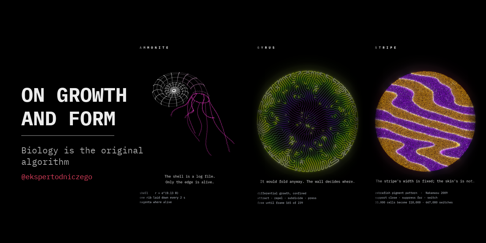

<div align="center">


[](https://instagram.com/ekspertodniczego)
[](https://www.python.org/)
[](LICENSE)
[](LICENSE)

</div>

Biological form is not drawn. It is computed — by tissue, by a growing tip, by
a sheet of filaments with no cell around them — and these are films of that
computation happening.

Nothing here illustrates a finished result. A model runs and the run is the
footage. Colour is never decoration either: it carries a quantity the model
already holds, so what you are looking at is the state of the simulation rather
than a reading of it. How old an organ is. Which of two cell states holds a
patch of skin. How far a bond has been stretched at that instant.

---

<table>
<tr>
<td width="33.33%"><a href="reels/defect/"></a></td>
<td width="33.33%"><a href="reels/stripe/"></a></td>
<td width="33.33%"><a href="reels/tear/"></a></td>
</tr>
<tr valign="top">
<td width="33.33%"><b><a href="reels/defect/">Defect</a></b><br><sub>Substrate</sub><br><br><i>Nothing here is alive.<br>It still cannot rest.</i></td>
<td width="33.33%"><b><a href="reels/stripe/">Stripe</a></b><br><sub>Wetware</sub><br><br><i>Turing predicted chemicals.<br>These are cells.</i></td>
<td width="33.33%"><b><a href="reels/tear/">Tear</a></b><br><sub>Wetware</sub><br><br><i>It reproduces by<br>disagreeing with itself.</i></td>
</tr>
<tr>
<td width="33.33%"><a href="reels/phyllotaxis/"></a></td>
<td width="33.33%"><a href="reels/hydrocreatures/"></a></td>
<td width="33.33%"><a href="reels/soliton/"></a></td>
</tr>
<tr valign="top">
<td width="33.33%"><b><a href="reels/phyllotaxis/">Phyllotaxis</a></b><br><sub>Wetware</sub><br><br><i>The plant is not counting.<br>You are.</i></td>
<td width="33.33%"><b><a href="reels/hydrocreatures/">Hydrocreatures</a></b><br><sub>Biomorph</sub><br><br><i>Nothing here intends anything.<br>You do.</i></td>
<td width="33.33%"><b><a href="reels/soliton/">Soliton</a></b><br><sub>Artificial Life</sub><br><br><i>Every one of these<br>was stable on its own.</i></td>
</tr>
</table>

**The full cuts are on [Instagram](https://instagram.com/ekspertodniczego).**

---

Each entry below is the update rule as implemented, followed by the parameters
the clip was actually run at. None of these rules contains the thing it
produces: there is no angle in the phyllotaxis rule, no fold in the growth rule,
no membrane, no stripe count and no spiral.

### Defect — an active nematic with no cell around it

**Code: [`src/substrate/`](src/substrate/) — `render.py --edition defect`**

Microtubules, kinesin, ATP. Beris–Edwards for the alignment tensor with one
elastic constant, coupled to Stokes flow, with an active stress proportional to
the alignment itself:

$$\partial_t Q + \mathbf{u}\cdot\nabla Q  =  S(\nabla\mathbf{u}, Q) + \Gamma H$$

$$\sigma^{\text{act}} = -\zeta\ Q$$

That last term is the whole piece: **alignment is turned into flow, and the flow
bends the alignment that produced it.** Above a threshold in activity — which
this model sits well past — a uniformly aligned film is unstable against its own
flow, so it buckles; a bend that keeps growing cannot stay a bend; and where the
director breaks it turns by half a turn around a point. Halves cannot exist alone, so $\pm\tfrac{1}{2}$ defects are created in
pairs and annihilate in pairs. The $+\tfrac{1}{2}$ has a comet head and swims,
the $-\tfrac{1}{2}$ has three arms and mostly sits.

| | |
| --- | --- |
| defects | 0 → 528 over the clip |
| charge balance | 232 of one sign against 234 of the other, counted well inside the drop |
| steady state | none — a fixed rate of tearing for as long as there is ATP |

Sanchez et al. (2012).

### Stripe — cell-level Turing, short-range support and long-range suppression

**Code: [`src/wetware/`](src/wetware/) — `render.py --edition stripe`**

Nakamasu et al. (2009), whose interaction was measured by laser-ablating cells
one at a time. Two Gaussians on the signed cell field:

$$D  =  G_{\sigma_{\text{near}}} * f  -  w\ \bigl(G_{\sigma_{\text{far}}} * f\bigr)$$

where $f = +1$ where the black-pigment state holds a site and $f = -1$ where the
yellow one does. A site adopts $\mathrm{sign}(D)$ with probability $\lambda$ per
step.

This is Turing's shape with **cells standing where the chemicals were**: the
short- and long-range terms are carried by pigment cells reading their own
neighbourhood, not by two diffusing substances. Nakamasu and colleagues measured
that interaction by ablating cells one at a time and watching what grew back.

**Two liberties, both the model's and not the fish's.** A site here is a binary
state that flips, which stands in for a much slower biological story — the real
tissue rearranges through cell death, division, migration and differentiation of
precursors, and a melanophore does not simply become a xanthophore. And the flip
is stochastic per step, which is a convenience for making the border legible
frame to frame rather than a measured rate. What survives the abstraction is the
interaction's *shape*, which is the part the pattern depends on.

The two ranges are the reach of one cell's processes, so they are fixed while
the skin keeps widening. A stripe therefore has a width it wants; existing
stripes are carried apart; and when the gap exceeds that width a new stripe
nucleates inside it. Nothing counts them — the number is the skin's height over
a width that no cell chose.

| | |
| --- | --- |
| cells | 33,000 → 118,000, with 667,000 type switches |
| growth | radius advances a **fixed amount** per step, not a fixed fraction — stripe count goes as radius, so only linear growth spreads the splitting evenly across the clip |
| convolution | `mode="nearest"`, never wrapped — a rim cell must not read the far side of the disc, or stripes stitch across the black |
| $\lambda$ | well under 1: switching every disagreeing cell at once gives a hard line that snaps between frames instead of a border being argued over |

### Tear — motility-induced fracture in a placozoan

**Code: [`src/wetware/`](src/wetware/) — `render.py --edition tear3 --palette prism --duration 10`**

*Trichoplax adhaerens* has no nerves and no muscle; it crawls on cilia, and
every ventral cell walks on its own. The alignment comes from Ferrante et al.
(2013): a cell is pulled by its neighbours and **turns toward the pull**.

$$\dot{\mathbf{x}}_i = v_0\ \hat{n}_i + \mu\ \mathbf{F}_i$$

$$\dot{\theta}_i = \beta\ \bigl(\mathbf{F}_i \cdot \hat{n}_i^{\perp}\bigr) + \eta_i$$

That rule alone lines thousands of cells up into one heading. But nothing
coordinates them globally, so a large enough animal holds patches that agree
internally and disagree with each other, and the tissue between them stretches.
Bonds past a strain threshold yield; bonds re-form between nearby cells of the
same animal, so the sheet tears rather than shatters. Prakash, Bull & Prakash
(2021) filmed tissue fracturing under its own crawling.

**In this model, growth acts as the reset clock.** Cells divide in place, so a
half grows back to the size at which it tears again, and the piece keeps
producing events instead of settling. That is an implementation choice, made
because without it the run is a one-off relaxation: measured before building,
sixteen animals shattered into thirty-seven pieces in the first quarter and
nothing tore afterwards — 85.2% of the change, then 0.0%. It is not a claim
about the timing of division in a real *Trichoplax*.

| | |
| --- | --- |
| $v_0$, $\beta$ | 0.3, 1.0 |
| rotational noise | 0.02 |
| bond spring | 1.0, with a strain threshold above which it yields |
| units | one cell spacing = 1; dish radius = 93 spacings |
| colour | animal identity — a tear is one colour becoming two; strain rides in the brightness |

### Phyllotaxis — inhibition-field organ placement

**Code: [`src/wetware/`](src/wetware/) — `render.py --edition phyllotaxis`**

Douady & Couder (1992). One organ per plastochrone, placed at the rim angle
that minimises the inhibition of those already down:

$$\theta_{n+1}=\arg\min_{\theta}\ \sum_{j\ \in\ \mathcal{N}} \lVert x(\theta)-p_j \rVert^{-2}$$

$$r_j \propto \sqrt{\mathrm{age}_j}$$

The radial law is not a choice of look. Organs are added at a constant rate, so
holding areal density constant requires area to grow at a constant rate, which
gives $r\propto\sqrt{t}$ and makes the head geometrically **self-similar**.

**No angle appears anywhere in the rule.** What the divergence settles to is a
property of the parameter regime, not a theorem: at the apex size used here the
placement locks into an ordered window and the measured median divergence comes
out at 137.37°, within a seventh of a degree of the golden angle. Other apex
sizes lock onto different fractions — near five thirteenths of a turn at one
setting, which throws the organs into thirteen separate arms — and above about
1.4 spacings the placement stops settling at all. Which window a setting falls
in can only be found by running it and measuring, which is what was done. The
Fibonacci parastichy counts (8, 13, 21 near the core; 21, 34, 55 at the rim)
follow from the rim flattening as the head widens.

| | |
| --- | --- |
| organs | 1,196 |
| inhibition sum | 60 nearest-youngest only — the $d^{-2}$ term puts everything older out of range |
| candidate angles | re-offset each step by a uniform fraction of their own spacing, or the result locks to the sampling grid rather than to the rule |
| colour | age, `APEX` ramp — youngest at the centre, so the bright end is the core |

### Hydrocreatures — three animals from one closed curve

**Code: [`src/biomorph/`](src/biomorph/) — `hydrocreatures.py --variant neon --no-caption`**

Nothing is simulated here and nothing emerges. One parametric curve, sampled
densely and drawn as dots, at three settings of the same expression:

$$k = 9\cos(ai)\sin(bi), \qquad e = 9\cos(ci)\sin(fi)$$

$$d = \frac{\lVert (k,e) \rVert^{3}}{999} + 1.2 - \frac{\sin^{3}\left(\tfrac{t}{2}+m\right)}{4}$$

$$p = d^{\ \sin\left(d^{2}-t+m\right)}$$

$$C = \frac{d}{9} - \frac{t}{24} + m$$

$$x = 99\sin C + k\ p, \qquad y = 99\sin 4C + e\ p$$

$d$ is the breath, $p$ the stretch, $C$ the lean that carries the figure along
its path. The three creatures differ in four small integers $(a,b,c,f)$ and one
phase $m$ — change one integer and a bell becomes a pod, a pod grows filaments,
the filaments close into a lily.

They were not designed, they were **found**: every harmonic set up to six was
scored on the *worst* moment of its cycle rather than the average, because a
shape that is a bell half the time and a cross the other half scores well on an
average and reads badly on screen. Eleven survived out of 1,260.

| | |
| --- | --- |
| samples | ~11,000 along one closed curve |
| search | 1,260 harmonic sets, 11 survivors, 3 shown |
| what is fitted | nothing — the animal is the closed form |

### Soliton — Lenia

**Code: [`src/alife/`](src/alife/) — `render.py --edition soliton --duration 10`**

Conway's Life with four things made continuous: a real number instead of a bit,
a smooth ring kernel $K$ instead of eight neighbours, one smooth growth curve
$G$ instead of birth and survival integers, and a timestep that moves the field
by a fraction of the growth rather than all of it.

$$A^{t+\Delta t}  =  \Bigl[\  A^{t} + \Delta t \cdot G\bigl(K * A^{t}\bigr) \ \Bigr]_{0}^{1}$$

What comes out are not blinkers and gliders but **solitons** — lumps of
continuous field, smooth-edged and internally structured, that hold themselves
together while they travel. Nothing about them is designed. A creature is a
point in parameter space, and almost all of that space is lethal in one of two
ways: the field collapses to nothing, or it grows without bound until it fills
the world. The survivors sit in the narrow band between and have to be searched
for.

| | |
| --- | --- |
| $\Delta t$ | 1/10 — a step moves the field by a tenth of the growth |
| creature | ring with a core, ~60 cells across, travelling at ⅓ cell per step |
| field | 12 copies of one creature, doubly periodic, simulated at half resolution and doubled on output |

Chan (2019).

---

## Run them yourself

All six are here in full under [`src/`](src/), and every one of them reproduces
its published clip.

```bash
git clone https://github.com/paulina-duda/on-growth-and-form.git
cd on-growth-and-form

conda env create -f environment.yml
conda activate on-growth-and-form
```

Conda rather than `pip` for one reason: **ffmpeg**. conda-forge's default build
is the LGPL one, which carries only libopenh264 — it advertises H.264 and then
fails partway through an encode. `environment.yml` asks for the GPL build by
name. If you would rather use `pip install -r requirements.txt`, bring your own
ffmpeg with libx264 and the scripts will find it.

```bash
cd src/wetware
python3 render.py --edition phyllotaxis --duration 8
python3 render.py --edition stripe --duration 8
python3 render.py --edition tear3 --palette prism --duration 10

cd ../substrate && python3 render.py --edition defect
cd ../alife && python3 render.py --edition soliton --duration 10
cd ../biomorph && python3 hydrocreatures.py --variant neon --no-caption
```

Those are the exact commands the published cuts were made with — the clip length
is a per-reel decision, so it is on the command line rather than in a default.

Clips and their cover stills land in `out/`. Add `--preview` to write the still
and stop, which takes about a second.

**Every one was checked against what was published**, not by eye: each writes a
cover frame that is pixel-identical to the shipped cut, zero pixels differing.
The parameters are the ones the clips were run at, and the comments explaining
why a number is what it is are the ones written when it cost something to find
out.

---

## Four editions

The work is sorted by what kind of claim a piece is allowed to make. Keeping
those claims apart is the discipline of the whole account: it is the difference
between showing you biology and showing you a curve that flatters you into
seeing biology.

| Edition | The process, and the claim it makes |
| --- | --- |
| **Wetware** | Morphogenesis — how a body builds itself. *This is biology, filmed as the algorithm it is.* |
| **Substrate** | Something a microscope can be pointed at, on a medium. *The medium is the computer.* |
| **Biomorph** | A parametric equation, not a simulation. *It only looks alive — and that is the point.* |
| **Artificial Life** | A rule invented inside a computer. *Being alive may be organisation, so it can be built out of numbers.* |

**Biomorph is the honest odd one out**, and *Hydrocreatures* is why it is worth
keeping. Nothing emerges and no piece there claims anything is alive; the
edition earns its place because apparent life out of a closed form is a real
fact about how cheaply intention can be faked. A body that changes shape
smoothly, travels in the direction it is pointing, and slows before it turns is
enough to trip the circuit.

**Artificial Life is the only edition with an opinion.** Everything else is a
fact about the world with a picture attached; that one is a picture with an
argument attached, and the argument is Langton's.

---

## Credits

The models are other people's; the films are mine. Where a piece rests on a
published model, the citation is burned into the frame rather than left to the
caption:

- **Douady & Couder, 1992** — the shoot apex as a physical system — *Phyllotaxis*
- **Nakamasu et al., 2009** — the zebrafish interaction, measured by laser ablation — *Stripe*
- **Ferrante et al., 2013** and **Prakash, Bull & Prakash, 2021** — alignment by pulling, and motility-induced fracture — *Tear*
- **Sanchez et al., 2012** — kinesin walking on microtubules — *Defect*
- **Bert Wang-Chak Chan, 2019** — Lenia — *Soliton*

Full citations with DOIs are in **[REFERENCES.md](REFERENCES.md)**, each one
checked against Crossref rather than typed from memory.

*Hydrocreatures* rests on no paper. Inspired by the generative sketches of
**@yuruyurau**, who posts them on X: [x.com/yuruyurau](https://x.com/yuruyurau).
The implementation, harmonic search, composition and rendering here are my own —
no code of his was used, and he is not an author of this.

---

## Why "On Growth and Form"

Partly borrowed from **D'Arcy Wentworth Thompson**, *On Growth and Form* (1917)
— the book that argued the shapes living things take are set by physics and
mathematics, and not by descent alone. Thompson had no computers and made the
argument with geometry. The point of running these as simulations is that his
claim is now cheap to test: write the rule, let it run, and see whether the
animal falls out.

---

## Licensing

- **Code** — [PolyForm Noncommercial 1.0.0](LICENSE). Free for any
  noncommercial purpose; **commercial use requires separate written permission.**
- **Renders, stills, animations and text** — © 2026 Paulina Duda.
  **All Rights Reserved.** Not open-licensed: ask before republishing,
  redistributing, training on, or building from them.
- **Vendored typefaces** — IBM Plex Mono under the SIL Open Font License 1.1,
  see [`src/fonts/NOTICE.md`](src/fonts/NOTICE.md).

Third-party inspirations and the scientific sources behind each model are
credited above and on the individual piece pages.

---

Paulina Duda — bioinformatician. The reels go out as
[@ekspertodniczego](https://instagram.com/ekspertodniczego).

<div align="center">
<br>
<a href="https://instagram.com/ekspertodniczego"></a>
</div>
