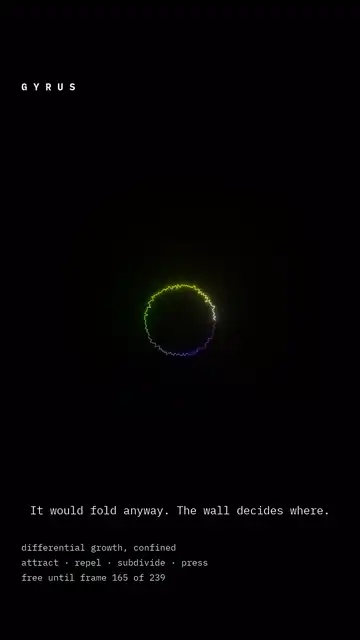

# Gyrus

**Wetware** · differential growth, run into a wall



> *It would fold anyway. The wall decides where.*

A closed curve that gains length faster than its container gains room. Nodes
push their neighbours apart, pull along the curve, and subdivide wherever a
segment has stretched too far. Nothing in that rule mentions a fold. The curve
buckles because it has nowhere else to put the length.

Confine it to a disc and the folds stop being arbitrary: they run to the wall,
turn along it, and pack into the rows that give the piece its name. The
confinement does not cause the folding — the same curve folds in open space —
it **chooses where each fold goes**, which is the more interesting half of the
result and the harder one to see without a control.

Colour is when a stretch of curve was added, so the bright ink is the newest
length and the dark interior is what has been there since the first frames.

```
differential growth, confined
attract · repel · subdivide · press
free until frame 165 of 239
```

<sub>The same engine as the account's first reel, re-cut into a dish with a
different palette and a different argument. 1080 × 1920, 8 s.
[On Instagram →](https://instagram.com/ekspertodniczego)</sub>
