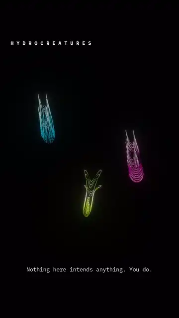

# Hydrocreatures

**Biomorph** · three animals that are not animals



> *Nothing here intends anything. You do.*

Everything visible is **one closed curve**, sampled about 11,000 times along its
length and drawn as dots, at three settings of the same expression:

```
k = 9·cos(ai)·sin(bi)        e = 9·cos(ci)·sin(fi)
d = ‖(k,e)‖³/999 + 1.2 − sin³(t/2 + m)/4
p = d^sin(d² − t + m)        C = d/9 − t/24 + m
x = 99·sin(C) + k·p          y = 99·sin(4C) + e·p
```

`d` is the breath — a slow oscillation folded into the radius. `p` is the
stretch, an exponent sweeping between plus and minus one six times over the
clip. `C` is the lean that carries the whole figure along its path. Bell, crown,
filaments, the pause at the top of the stroke: all of it is those five lines and
a lot of dots.

The three differ in four small integers `(a, b, c, f)` and one phase `m`. Change
one integer and a bell becomes a pod, a pod grows filaments, the filaments close
into a lily.

They were not designed, they were **found**. Every harmonic set up to six was
scored on the *worst* moment of its cycle rather than the average, because a
shape that is a bell half the time and a cross the other half looks fine on an
average and terrible on screen. Eleven came through out of 1,260; these are
three of the eleven, picked off a contact sheet for reading as three different
animals.

The uncomfortable part is that none of it has to be alive for you to read it as
alive. A body that changes shape smoothly, travels in the direction it is
pointing, and slows before it turns is enough. We are tuned to find purpose in
motion, and this trips that circuit without containing anything that could hold
a purpose.

Nothing grows, nothing senses, nothing decides. Whatever you caught them wanting
is yours.

<sub>No external model — the curve and the harmonic search are this project's
own. 1080 × 1920, 8 s.
[On Instagram →](https://instagram.com/ekspertodniczego)</sub>
